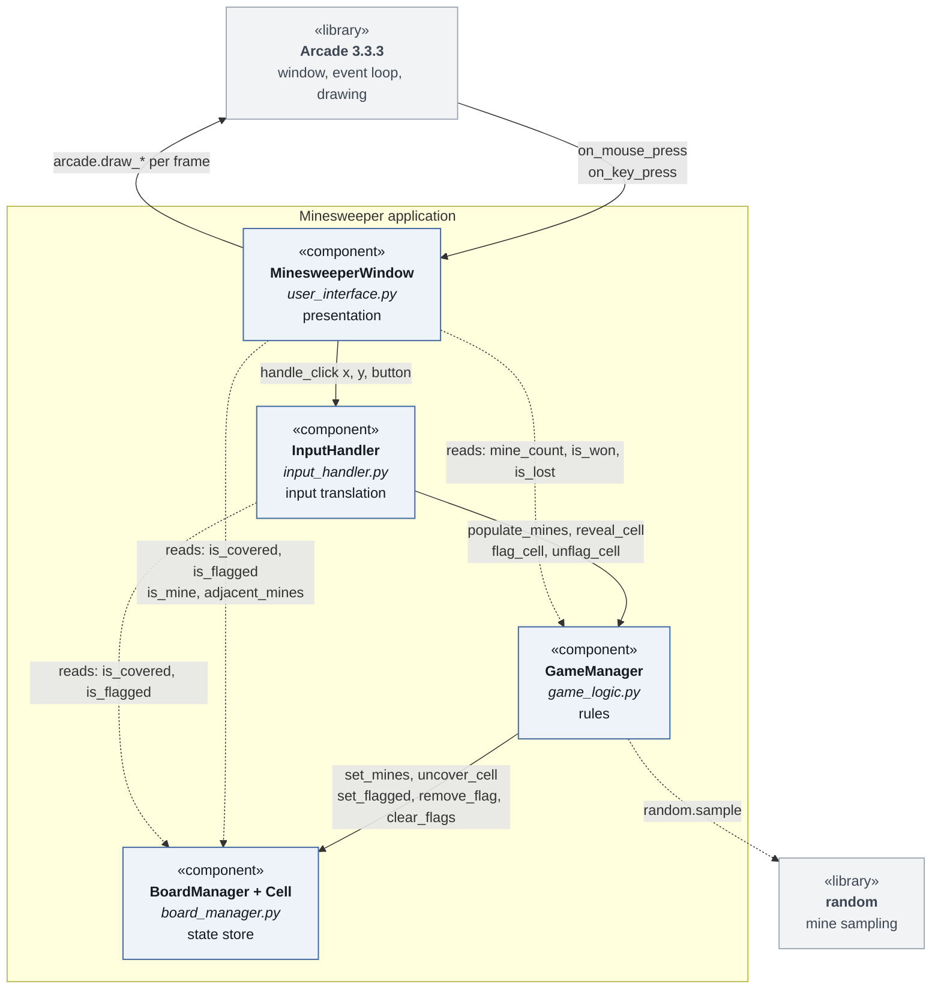
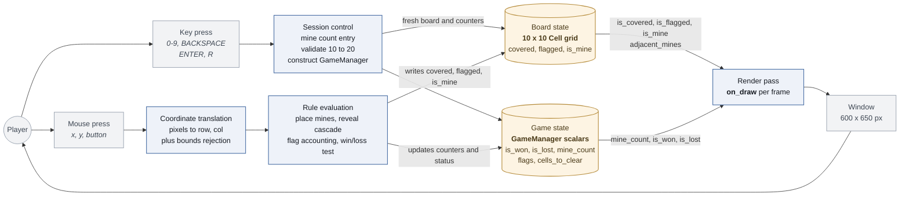
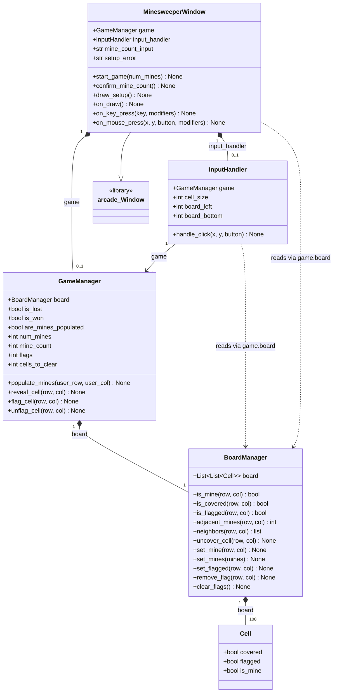

# Overview of Diagrams

This file contains the mermaid diagrams to display the diagrams of system components, data flow, and key data structures of our minesweeper program. The file is a .md, despite the mermaid file suffix of .mmd, as most markdown viewers are able to render these mermaid diagrams.
Attribution: These diagrams were created with the aid of Claude Opus 5, and then verified by Kyler Russell.

## Diagram of System Components

This diagram displays the system components of our minesweeper program.

## Data Flow

This diagram displays the dataflow of our minesweeper program.

## Key Data Structures

This diagram displays the key data structures of our minesweeper program.

